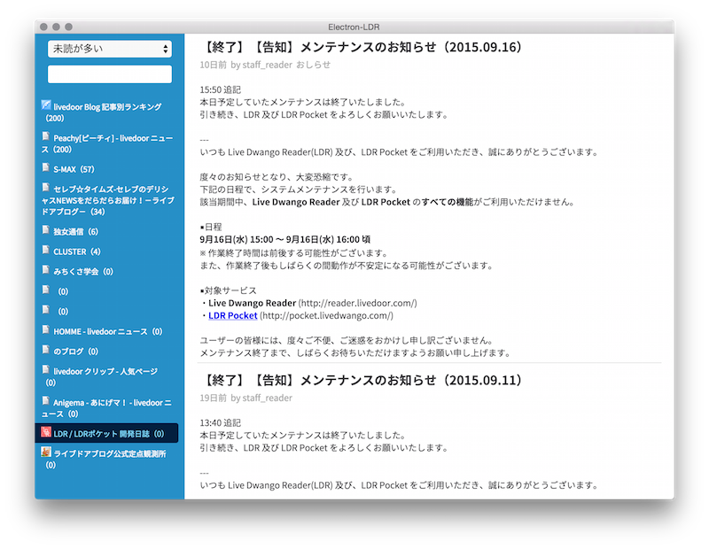
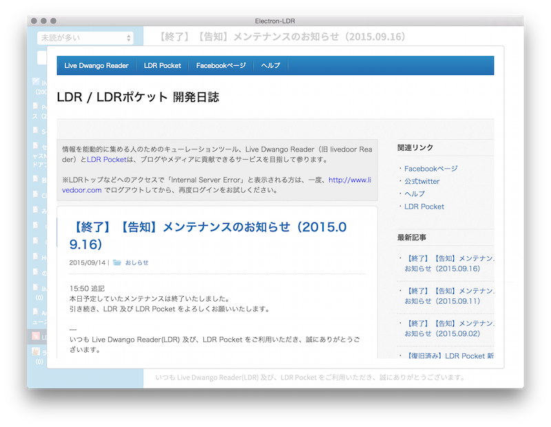
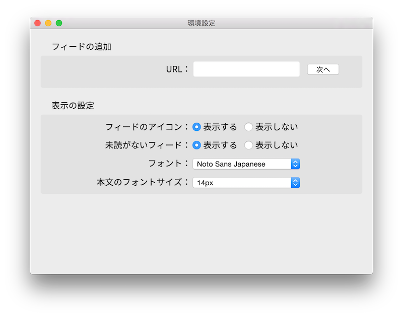

Live Dwango Reader（旧 Live Door Reader）を Electron でデスクトップアプリ化するプロジェクト。
バイナリのダウンロードは [releases](https://github.com/k0sukey/Electron-LDR/releases) からどうぞ。





## うごかしかた

GitHub からクローンします。

```sh
$ git clone git@github.com:k0sukey/Electron-LDR.git
$ cd Electron-LDR
```

必要な npm パッケージをインストールします。

```sh
$ npm install
```

コマンドラインで起動します。

```sh
$ npm start
```

## LDR API のつなぎ込み状況

**参考** [http://zuzu.hateblo.jp/entry/20091011/1255337739](http://zuzu.hateblo.jp/entry/20091011/1255337739)

- [x] **/api/feed/discover** POST ```{ feedlink: String }``` たぶんやらない → 設定に入れた
- [x] **/api/feed/subscribe** POST ```{ feedlink: String }``` たぶんやらない → 設定に入れた
- [x] **/api/feed/unsubscribe** POST ```{ subscribe_id: String }``` クッキーに ```reader_sid``` も必要
- [x] **/api/subs** GET/POST ```{ unread: 0/1 }```
- [x] **/api/all** GET/POST ```{ subscribe_id: String, offset:Number, limit: Number}```
- [x] **/api/unread** GET/POST ```{ subscribe_id: String }```
- [x] **/api/touch_all** GET/POST ```{ subscribe_id: String }``` クッキーに ```reader_sid``` も必要
- [ ] **/api/feed/set_rate** POST ```{ subscribe_id: String, rate: [0-5] }``` たぶんやらない
- [x] **/api/folders** GET/POST たぶんやらない → サイドバーの横に入れた
- [x] **/api/folder/create** POST ```{ name: String }``` たぶんやらない → 設定に入れた
- [x] **/api/folder/delete** POST ```{ folder_id: String }``` たぶんやらない → 長押しで実装した
- [x] **/api/feed/move** POST ```{ subscribe_id: String, to: String }``` たぶんやらない → ドラッグアンドドロップで実装した	
- [x] **/api/pin/all** POST ピンの付け外しに。たぶん一覧表示はやらないと思う
- [x] **/api/pin/add** POST ```{ link: String, title: String }``` クッキーに ```reader_sid``` も必要
- [x] **/api/pin/remove** POST ```{ link: String }``` クッキーに ```reader_sid``` も必要
- [x] **/api/pin/clear** POST 一覧表示をやらないならこれもやらないと思う → メニュー内で実装した

## キーボードショートカットの実装状況

- [x] <kbd>j</kbd> 次のアイテム
- [x] <kbd>k</kbd> 前のアイテム
- [x] <kbd>space</kbd> 下にスクロール
- [x] <kbd>shift + space</kbd> 上にスクロール
- [ ] <kbd>&lt;</kbd> 過去の記事に移動 たぶんやらない
- [ ] <kbd>&gt;</kbd> 未来の記事に移動 たぶんやらない
- [x] <kbd>v</kbd> 元記事を開く（独自：閉じる）
- [x] <kbd>p</kbd> ピンを付ける / 外す
- [x] <kbd>o</kbd> ピンを開く → メニュー内で実装した
- [x] <kbd>c</kbd> 本文の表示 / 非表示
- [x] <kbd>delete</kbd> 購読停止
- [x] <kbd>r</kbd> フィード一覧の更新
- [x] <kbd>z</kbd> マイフィードを畳む / 戻す
- [x] <kbd>f</kbd> 検索ボックスに移動
- [x] <kbd>s</kbd> 次のフィードに移動
- [x] <kbd>a</kbd> 前のフィードに移動
- [ ] <kbd>w</kbd> 最初の未読に移動
- [ ] <kbd>shift + w</kbd> 最後の未読に移動
- [x] <kbd>?</kbd> ヘルプを表示 / 非表示

**独自のキーボードショートカット**
- [x] <kbd>b</kbd> 元記事をブラウザで開く
- [x] <kbd>command or control + 1-9</kbd> フォルダを移動
- [x] <kbd>command + ,</kbd> 設定を開く
- [x] <kbd>command + q</kbd> アプリを終了

## 設定

アプリのメニューか、キーボードショートカットで設定を開くことができます。
フィードの登録、フィード一覧のアイコンの表示・非表示、未読のないフィードの表示・非表示、フォント、本文のフォントサイズを変更することができます。

