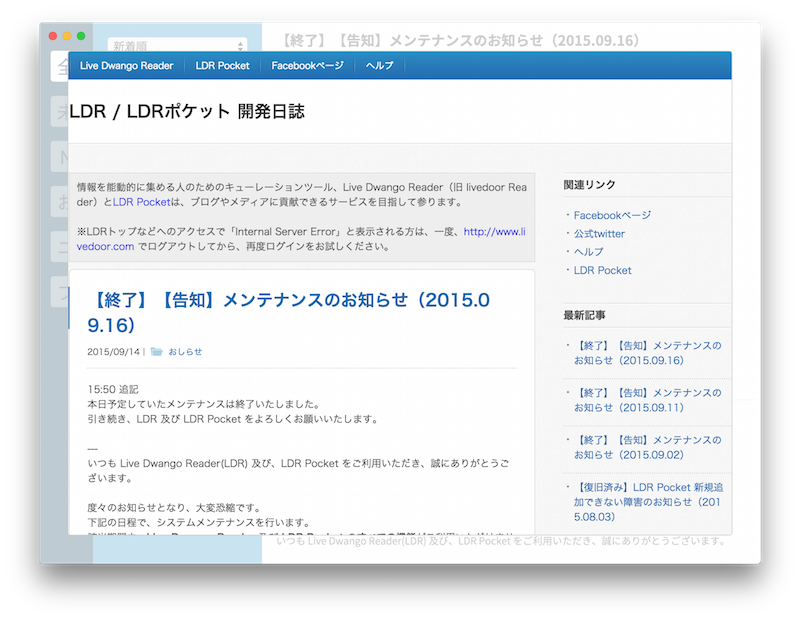

# Electron-LDR

Live Dwango Reader（旧 Live Door Reader）を Electron でデスクトップアプリ化するテスト。





## できること

* 登録されているフィードの一覧を読み込む
* 選択されたフィードを読み込む
* 選択されたウェブページを読み込む

## まだできていないこと

* 認証
* キーボードショートカット

その他いっぱい。
フィードは意図的に既読にもしていません。

## うごかしかた

GitHub からクローンします。

```sh
$ git clone git@github.com:k0sukey/Electron-LDR.git
$ cd Electron-LDR
```

必要な npm パッケージをインストールします。

```sh
$ npm install
```

認証ができていないので、[http://api.ma.la/reader.html](http://api.ma.la/reader.html) からアクセストークンをもらってきます。
authorize して、インスペクタ等でローカルストレージにあるアクセストークンを package.json にコピペしてください。
有効期限が切れたらもう一度 authorize すれば OK です。

```json
{
  "access_token": "****************************************",
  "token_type": "Bearer",
  "expires_in": 7200,
  "created_at": 1442133518
}
```

↑の access_token を、

```json
{
  "name": "Electron-LDR",
  // 略
  "devDependencies": {
    "electron-packager": "^5.0.2",
    "electron-prebuilt": "^0.31.0",
    "gulp": "^3.9.0",
    "gulp-babel": "^5.2.1",
    "gulp-load-plugins": "^0.10.0"
  },
  "token": "ここにコピペしてください"
}
```

コマンドラインで起動します。

```sh
$ npm start
```